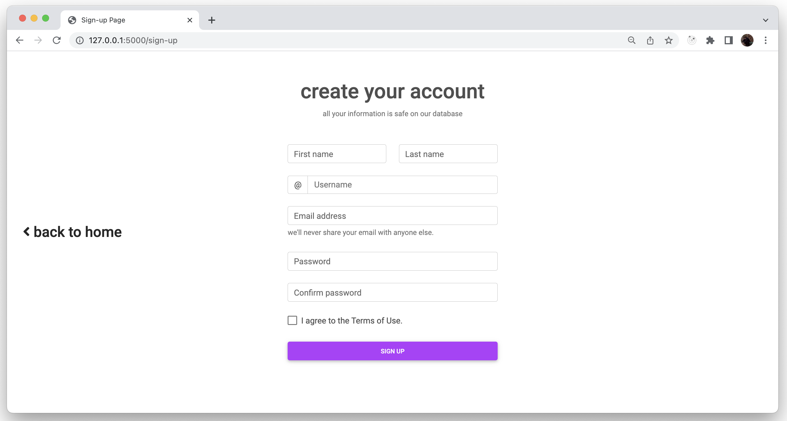

# Movie Town
Welcome to my web application project writtten using Flask. In this website you can search for different movies and tv shows. Explore their cast, director; see pictures of them and add them to your watchlist.


Huge thanks to 'stefanoleone992' for the collection of movies (aka. the dataset), which is used in the project. You can find the dataset from the below kaggle repo.

The Movie Collection: https://www.kaggle.com/stefanoleone992/imdb-extensive-dataset

UPDATE (Feb. 18, 2023): Unfortunately, the dataset is no longer available. So, the above link does not work anymore :(


# The Design
Front end is pretty basic and does not use any fancy frameworks like React or Angular. The only libraris used are Jinja2 and BootStrap5 to help me create a better and develpod faster template-based & responsive pages.

TODO: Add the search bar here.

Most of the front end designs are made by me. Except the login and signup pages. They are from a tutorial I followed on YouTube.


The general design philosophy is to be as eye-candy as possible! There are blur effects, shadow effects, colorful elements and many more. But do note that my main focus on this project is on the back end side. So, some front end elements might look bad for you. Sorry in advance :/


# The Technology
On my website users can create and login to their account. 
Most, if not all features are available only when you login. All passwords and other sensitive info are encrypted before saved to the database.


Below is the list of technologies used in Movie Town.
```bash
Flask # Web application framework
Flask-Session # User session library

MongoDB # Main database. Users and movies are stored here
ElasticSearch # Search database. Movies are indexed here
RabbitMQ # Message queue. HTTP requests are stored here
Redis # In-memory database. For storing user sessions and etc.
Docker # Runs the above web services

Bcyrpt # Used to 'encrypt' passwords
Pandas # Used to manipulate CSV files
```

Main database is MongoDB. All the movies, users and 
other information are stored there (locally). There is
ElasticSearch built on top of it. Search operations from the user are queried from this database.

The most common elements, like the logo and daily quotes, are pulled from Redis cache.

On the other hand, RabbitMQ is used as an interface between the web server (producer) and the workers (consumer). All CRUD operations are packaged inside messages and are forwarded to the workers.

# Installation
This section will guide you through the installation process. Spoiler alert! It is kinda long.

Quick notes before starting this tutorial
----
* You will need at least a decent modern CPU and 4GBs of RAM.
* The web application might be unstable because it depends on many different services.
* Because of the architecture you need two apps running.
* First app is the main flask app (web server) and the other is the worker (the app that handles user requests).
* You can open up as many worker as you want.
* If an apps fails just restart it >.<
* Feel free to contact me if anything goes wrong.
----

## **Python3**
The Flask framework is written in Python3. So we need to install it.

### **Linux**
Install 'python3, pip and venv' using the 'apt'
```console
$ sudo apt update # Refresh apt repository
$ sudo apt install python3 # Python3
$ sudo apt install pip3 # Python Package Manager
$ sudo apt install python3-venv # Python Virtual Environment
```

### **macOS**
Install 'python3, pip and venv' using 'brew'
```console
$ brew install python # Installs Python3, Pip and Venv
```

### **Windows**
Download and Install 'python3, pip and venv' using '.exe installer'
```console
# Download the .exe from the below link
# "https://www.python.org/downloads/windows/"

# Open the installer and follow the instructions there
```

### **Check Python3 Installation**
Test the installation (bash/zsh/cmd/powershell)
```console
$ python3 --version # Python3
> Python 3.10.6

$ python3 -m pip --version # Pip
> pip 22.0.2 from ... (python 3.10)
```

## **Docker**
I  used Docker to quickly deploy and run my web services. MongoDB, ElasticSearch, Redis and RabbitMQ are required for the web application to work.

There is a'docker-compose' file too. Docker-compose makes deploying multiple services at-once WAY easier. So, we need to install it too.

### **Linux**
Add docker-se to your 'apt' repository
```console
$ sudo apt install apt-transport-https ca-certificates curl software-properties-common # Install Curl and dependicies

$ curl -fsSL https://download.docker.com/linux/ubuntu/gpg | sudo apt-key add - # Add docker gpg to 'apt'

$ sudo add-apt-repository "deb [arch=amd64] https://download.docker.com/linux/ubuntu focal stable" # Add docker repository

$ apt-cache policy docker-ce # Check if Docker is added
```

Install Docker
```console
$ sudo apt install docker-ce # Install Docker
```

Install Docker-compose
```console
$ sudo curl -L "https://github.com/docker/compose/releases/download/1.29.2/docker-compose-$(uname -s)-$(uname -m)" -o /usr/local/bin/docker-compose # Add docker-compose binary to Linux bin directory

$ sudo chmod +x /usr/local/bin/docker-compose # Give docker-compose execution permission
```

### **macOS**
```console
# Download the .dmg from the below link
https://www.docker.com/products/docker-desktop/


# Open the .dmg file and Install Docker
```

### **Windows**
```console
# Download the .exe from the below link
https://www.docker.com/products/docker-desktop/


# Open the installer and follow the instructions there
```

### **Check Docker Installation**
Test the installation (bash/zsh/cmd/powershell)
```console
$ docker --version
> Docker version 20.10.22, build 3a2c30b

$ docker-compose --version
> Docker Compose version v2.15.1
```

## **Movie_Town**
Now that we have all the pre-requisites, let's install the actual project.

### **Clone The Repository**
If you do not have 'git' installed on your system. You can also download the project as a '.zip' found at the top of this page.
```console
$ git clone --depth 1 https://github.com/TunaCici/Movie_Town.git
```

### **Install the required python3 packages**
The project has many python3 package dependicies. We need to install them.
```console
$ cd Movie_Town/ # Change directory into Movie_Town
$ python3 -m pip install -r requirements.txt
```

### **Deploy The Services**
MongoDB, ElasticSearch, Redis and RabbitMQ can be deployed using the docker-compose file. They are required for this project.
```console
$ docker-compose up -d # Download the services and run them

$ docker ps --format "{{.ID}}\\t{{.Status}}\\t{{.Names}}" # Check if they are running
> 6343c28c8b4b	Up 2 hours	mongodb-service
> 134adbf3f58c	Up 2 hours	elastic-service
> 213776ec6028	Up 2 hours	rabbit-service
> 2b314e48c465	Up 2 hours	redis-service
```

### **Initialize Databases**
Initially, the databases are empty. We need to feed them with some data. The data we have is a collection of movies. The python code 'init_db.py', initializes MongoDB and ElasticSearch.

Note: This step might take a while depending on your system.
```console
$ python3 init_db.py
```

### **Initialize Movie Posters (optional)**
The front end displays each movie with their poster. It makes the UI/UX way better! However, these posters are large in size so they are not included in this Git-Hub repository (yet!). So, we need to download them one-by-one using the TMDB API.

Do not worry though, I have written a script for that.
Note: This step might take hours depending on your network and the TMDB API.
```console
$ python3 utils/imdb_helper.py
```

After all the posters are downloaded, move them to the 'static' folder.
```console
$ mv -r data/posters static/data/posters
```

# **Usage**
Everything is ready! Let's run this web application.

## **Start The Web Server**
This is the Flask web server. It listens to HTTP requests and forwards some of them to the workers using RabbitMQ message queues (aka. producer).
```console
$ python3 main.py
```

## **Start a Worker**
Workers are custom made programs that handles some user requets. Most importantly they run CRUD operations on the web services. So, if you want to signup, login, search movies and etc., you need to start a worker.

You can start as many workers as you want.
```console
$ python3 worker.py
```

## **Home Page**
This is a static page where I give information about Movie Town. There is a carousel that shows 3 different movies. They are randomized every time the page is loaded (try refreshing the page).


## **Login/Signup Page**
This is the page where you can create a new account and login. The 'I aggree to the Terms of Use' does actually nothing. It's just there to make the page more 'professional' >.<


## **Profile Page**
This is your user profile. As simple as that. Every user profile picture is assigned to them randomly at creation time. You can see all possible profile picture from the directory 'static/data/profile_pictures'.


## **Search Page**
Here is the heart of this project. You can search from a selection of movies. Everytime you type something to the search bar, a new result will appear! Just like Google, but slower. From the resultant movies, you can add them to your watchlist.


## **Watchlist Page**
From the previous page we have seen that we could add movies to our watchlist. Now, in this page we can actually list them.


## **Explore!**
So far, I have showed you main things this web application can do. However, you should explore it on your own for learning purposes! After all, this project is made for the sole purpose of learning and testing out different technologies.

Feel free to contact me, if you have any questions. I will try to improve this project and am aiming to make it an 'example' web application that people can explore to learn new things!